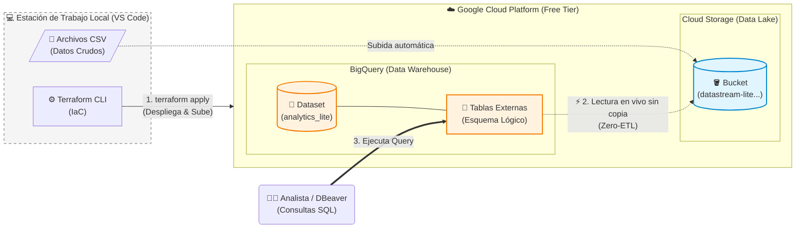
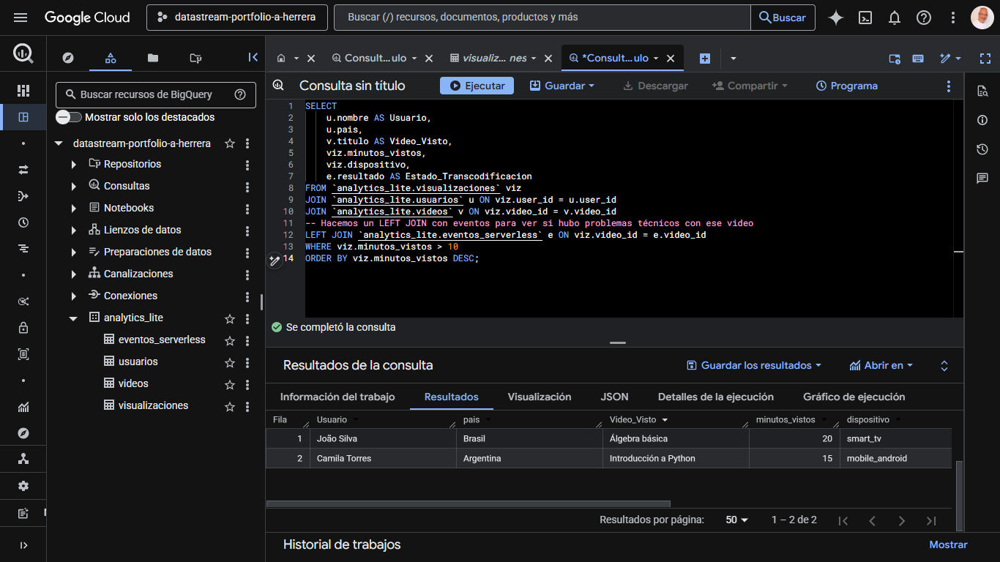
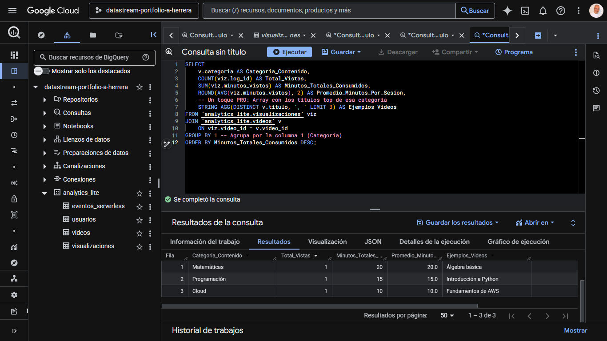

# Datastream Analytics Lite 🚀

### Infraestructura de Data Lakehouse Serverless en GCP, usando Terraform.
### Desarrollado por: Alejandro Nelson Herrera Soria
### Linkedin: https://www.linkedin.com/in/alejandro-nelson-herrera-soria

## 📋 Descripción del Proyecto

Este proyecto implementa una arquitectura **Data Lakehouse** serverless en Google Cloud Platform (GCP). El objetivo es proveer una plataforma de analítica de bajo costo y alto rendimiento para la startup "Datastream", permitiendo la ingesta de archivos CSV y su consulta inmediata vía SQL sin procesos de carga complejos.

## 🏗️ Arquitectura

La solución sigue un enfoque **Zero-ETL** utilizando Tablas Externas de BigQuery:

1. **Infrastructure as Code (IaC):** Todo el despliegue se gestiona con **Terraform**.
2. **Data Lake (Storage):** Bucket de Google Cloud Storage (`Standard Class`) con políticas de ciclo de vida.
3. **Data Warehouse (Compute):** **BigQuery** configurado con tablas externas que leen directamente del Data Lake.
4. **Seguridad:** Gestión de identidades vía Service Accounts y `terraform.tfvars` (excluido del repo).



## 🛠️ Stack Tecnológico
* **Google Cloud Platform** (Free Tier compliant)
* **Terraform** (IaC)
* **BigQuery** (SQL Analytics)
* **Cloud Storage** (Object Storage)
* **SQL** (Joins, Aggregations, Window Functions)

## 🚀 Cómo desplegar

Pre-requisitos: Google Cloud SDK instalado y Terraform.

1. **Clonar el repositorio:**

   ```bash
   git clone [https://github.com/AleHerreraSoria/Infraestructura-de-Data-Lakehouse-Serverless-en-GCP-mediante-Terraform.git](https://github.com/AleHerreraSoria/Infraestructura-de-Data-Lakehouse-Serverless-en-GCP-mediante-Terraform.git)
   ```

2. **Configurar variables:**
   Crear un archivo `terraform.tfvars` con tu `project_id`:

   ```hcl
   project_id = "tu-id-de-proyecto"
   region     = "us-central1"
   ```
3. **Desplegar:**

   ```bash
   terraform init
   terraform apply
   ```

## 📊 Ejemplos de Análisis

El sistema permite responder preguntas de negocio complejas mediante SQL estándar.

### Query 1: Limpieza y Filtrado de "Engaged Views"

Esta consulta tiene como objetivo filtrar el 'ruido' de los datos crudos. Seleccionamos únicamente las visualizaciones significativas (mayores a 10 minutos) para garantizar que el análisis se base en consumo real y no en clics accidentales o rebotes.

```sql
SELECT 
    u.nombre AS Usuario,
    u.pais,
    v.titulo AS Video_Visto,
    viz.minutos_vistos,
    viz.dispositivo,
    e.resultado AS Estado_Transcodificacion
FROM `analytics_lite.visualizaciones` viz
JOIN `analytics_lite.usuarios` u ON viz.user_id = u.user_id
JOIN `analytics_lite.videos` v ON viz.video_id = v.video_id
-- Hacemos un LEFT JOIN con eventos para ver si hubo problemas técnicos con ese video
LEFT JOIN `analytics_lite.eventos_serverless` e ON viz.video_id = e.video_id
WHERE viz.minutos_vistos > 10
ORDER BY viz.minutos_vistos DESC;
```

### Evidencia de Ejecución: Query 1 (Joins Complejos)



### Query 2: Visión 360° - Enriquecimiento de Datos (Joins)

Implementación de un modelo de desnormalización mediante SQL Joins. Cruzamos la tabla de hechos (visualizaciones) con las dimensiones (usuarios, videos) y los logs técnicos (eventos). Utilizamos LEFT JOIN estratégicamente para incluir datos de auditoría técnica sin perder registros de visualización válidos..

```sql
SELECT 
    -- Datos del Usuario
    u.nombre AS Usuario,
    u.pais AS Pais,
  
    -- Datos del Video
    v.titulo AS Video_Visto,
    v.categoria,
  
    -- Métricas de Consumo
    viz.minutos_vistos,
    viz.dispositivo,
  
    -- Datos Técnicos (Serverless Events)
    e.accion AS Evento_Sistema,
    e.resultado AS Estado_Proceso
FROM `analytics_lite.visualizaciones` viz
-- Unimos con quién vio el video
JOIN `analytics_lite.usuarios` u 
    ON viz.user_id = u.user_id
-- Unimos con qué video es
JOIN `analytics_lite.videos` v 
    ON viz.video_id = v.video_id
-- LEFT JOIN porque quizás no todos los videos tienen eventos registrados
LEFT JOIN `analytics_lite.eventos_serverless` e 
    ON viz.video_id = e.video_id
ORDER BY viz.minutos_vistos DESC;
```

### Evidencia de Ejecución: Query 2 (Métricas de Negocio)


### Query 3: Reporte Ejecutivo - KPIs por Categoría

Generación de métricas de alto nivel para la toma de decisiones. Utilizamos funciones de agregación (COUNT, SUM, AVG) para entender el rendimiento por categoría de contenido. Además, aplicamos STRING_AGG para concatenar ejemplos de títulos en una sola celda, facilitando la lectura del reporte sin generar filas duplicadas.

```sql
SELECT 
    v.categoria AS Categoria_Contenido,
    COUNT(viz.log_id) AS Total_Vistas,
    SUM(viz.minutos_vistos) AS Minutos_Totales_Consumidos,
    ROUND(AVG(viz.minutos_vistos), 2) AS Promedio_Minutos_Por_Sesion,
    -- Un toque PRO: Array con los títulos top de esa categoría
    STRING_AGG(DISTINCT v.titulo, ', ' LIMIT 3) AS Ejemplos_Videos
FROM `analytics_lite.visualizaciones` viz
JOIN `analytics_lite.videos` v 
    ON viz.video_id = v.video_id
GROUP BY 1 -- Agrupa por la columna 1 (Categoría)
ORDER BY Minutos_Totales_Consumidos DESC;
```

### Diagrama / Query Adicional



⚠️ Disclaimer

Este proyecto utiliza Tablas Externas para optimizar costos en la capa gratuita. En un entorno productivo de alta concurrencia, se recomendaría un pipeline de ingesta (ej: Dataflow o Airbyte) para materializar las tablas en BigQuery y mejorar la performance de lectura.
